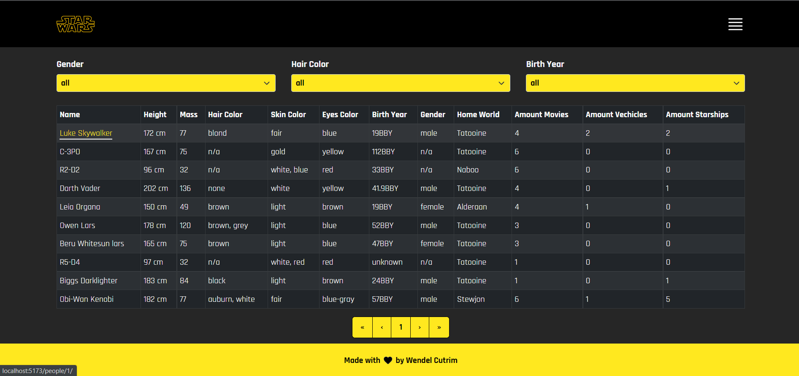
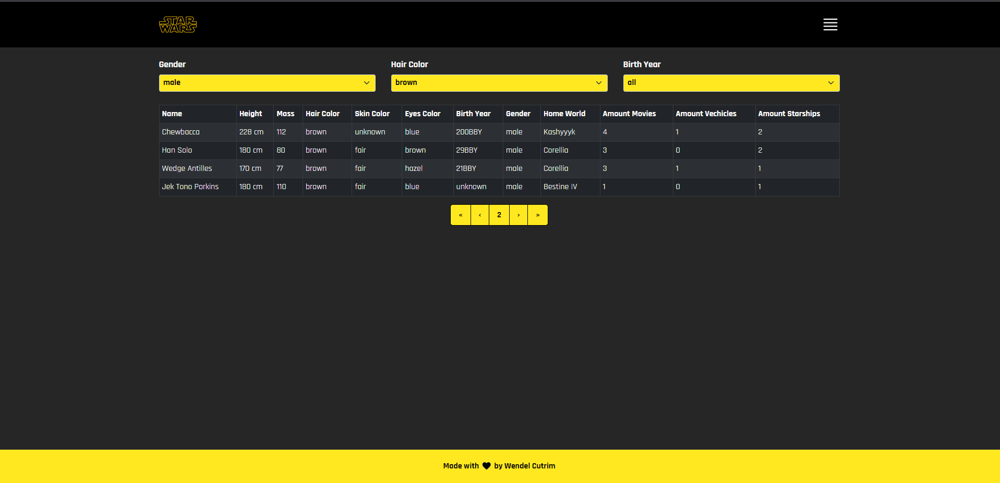
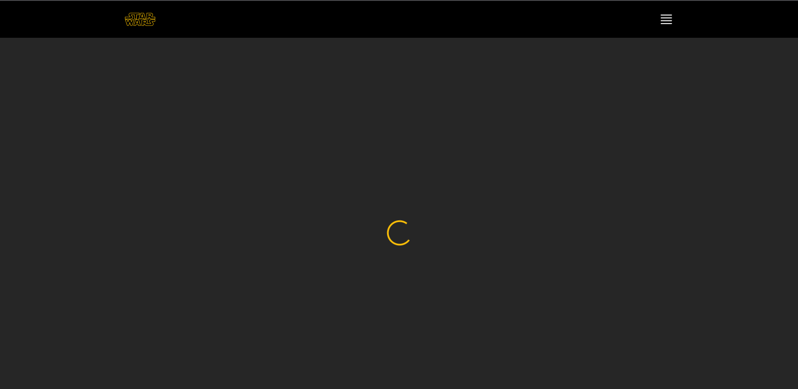
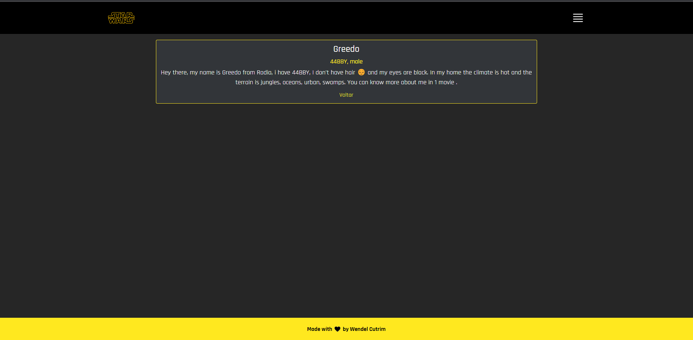

# grid-starwars



## About the project
Created this project to practice my knowledge about React, TypeScript and as a challenge for a developer job using the Swap API.

## Tech Stack
**Front-end:** React, Typescript, React Bootstrap.
## Run Locally

**Clone the project**
```bash
git clone https://github.com/wendelcutrim/grid-starwars.git
```

**Go to the project directory**
```bash
cd grid-starwars
```

**Install the dependencies**

```bash
npm install
```

### Scripts

**Build**
```bash
npm run build
```

**Dev (Run locally)**
```bash
npm run dev
```

**Preview**
```bash
npm run preview
```

💡 After installing the dependencies of the project, its necessary to set up the environment variable of the SWAP API endpoint.
Copy the **.env.example** file and rename to **.env**. On this file, set the SWAP API endpoint: `https://swapi.dev/api`

## Color Reference
In this project, I chose to select a color palette that resembles the star wars theme

| Color             | Hex                                                                |
| ----------------- | ------------------------------------------------------------------ |
| Pages Background |  #262626 |
| Primary Color |  #FFE81F |
| Header and secundary text colors |  #000000 |
| Primary text colors |  #FFFFFF |

## Features

- Filter by Gender, Hair Color and Birth Year
- Pagination
- Individual presentation of each character
- Loading effect

## Author

- [@wendelcutrim](https://www.github.com/wendelcutrim)

## Screenshots

Home Page


Filtered information


Loading effect


Individual page


